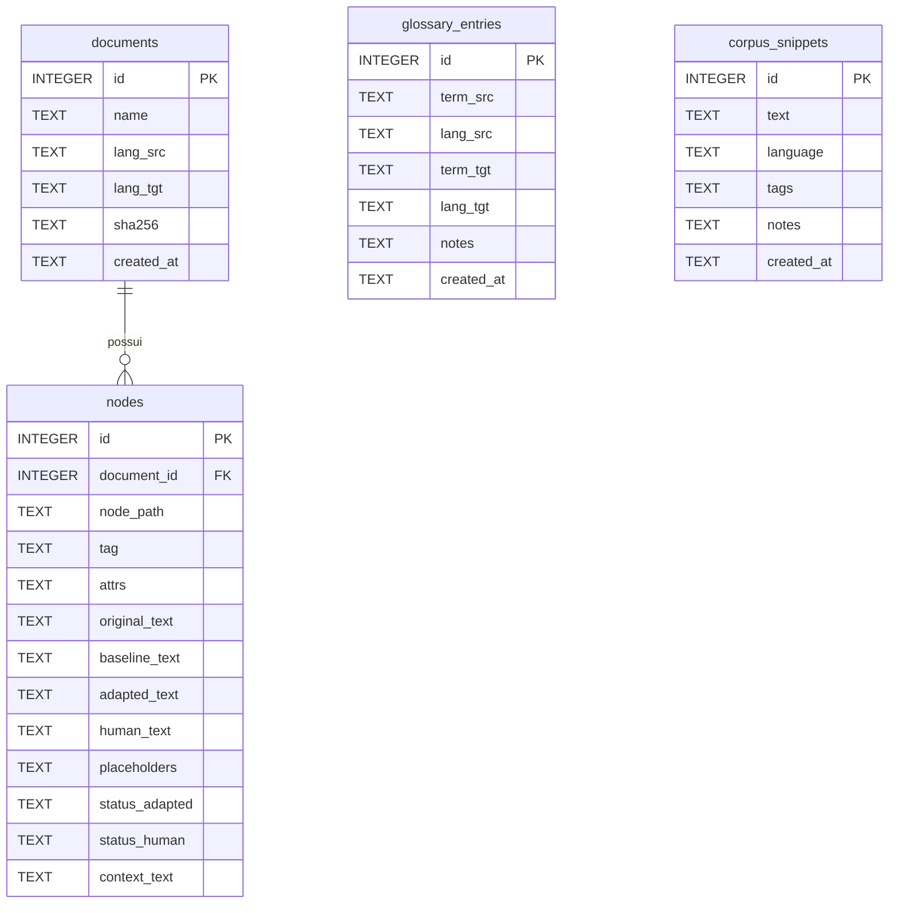

**Modelo Lógico de Banco de Dados (SQLite)**

**Visão Geral**
- Banco: `SQLite` inicializado por `src/persistence/db.py`.
- Tabelas principais: `documents`, `nodes`, `glossary_entries`, `corpus_snippets`.
- Relacionamentos: `nodes.document_id` → `documents.id` (1:N). `glossary_entries` e `corpus_snippets` são independentes.

**Entidades e Colunas**
- `documents`
  - `id` (INTEGER, PK)
  - `name` (TEXT, obrigatório): nome base do documento (ex.: `InteriorTeor30`).
  - `lang_src` (TEXT, obrigatório): idioma fonte (ex.: `pt`).
  - `lang_tgt` (TEXT, obrigatório): idioma alvo (ex.: `en` ou `es`).
  - `sha256` (TEXT, opcional): hash do arquivo para integridade/cache.
  - `created_at` (TEXT, default `CURRENT_TIMESTAMP`): timestamp de criação.

- `nodes`
  - `id` (INTEGER, PK)
  - `document_id` (INTEGER, FK → `documents.id`, obrigatório): referência ao documento.
  - `node_path` (TEXT, obrigatório): caminho único do nó no DOM indexado.
  - `tag` (TEXT, opcional): tag HTML (ex.: `p`, `h1`).
  - `attrs` (TEXT, opcional, JSON): atributos do nó (classe, id, etc.).
  - `original_text` (TEXT, obrigatório): conteúdo original do nó.
  - `baseline_text` (TEXT, opcional): tradução baseline.
  - `adapted_text` (TEXT, opcional): tradução adaptada (com RAG/glossário/corpus).
  - `human_text` (TEXT, opcional): tradução humana (quando fornecida).
  - `placeholders` (TEXT, opcional, JSON): marcadores/variáveis detectadas.
  - `status_adapted` (TEXT, opcional): estado da adaptação (`pending`, `fresh`, `stale`).
  - `status_human` (TEXT, opcional): estado da tradução humana (`none`, `fresh`).
  - `context_text` (TEXT, opcional): contexto utilizado (ex.: trechos recuperados pelo RAG).

- `glossary_entries`
  - `id` (INTEGER, PK)
  - `term_src` (TEXT, obrigatório)
  - `lang_src` (TEXT, obrigatório)
  - `term_tgt` (TEXT, obrigatório)
  - `lang_tgt` (TEXT, obrigatório)
  - `notes` (TEXT, opcional)
  - `created_at` (TEXT, default `CURRENT_TIMESTAMP`)

- `corpus_snippets`
  - `id` (INTEGER, PK)
  - `text` (TEXT, obrigatório)
  - `language` (TEXT, obrigatório)
  - `tags` (TEXT, opcional, JSON array)
  - `notes` (TEXT, opcional)
  - `created_at` (TEXT, default `CURRENT_TIMESTAMP`)

**Relacionamentos e Cardinalidades**
- `documents` 1:N `nodes` via `nodes.document_id`.
- `glossary_entries` e `corpus_snippets` não possuem FKs; são coleções auxiliares usadas no RAG/adaptação.

**Diagrama ER (Mermaid)**

**Operações Principais (Repos)**
- `DocumentRepository`
  - `upsert_document(name, lang_src, lang_tgt, sha256)`: insere/atualiza documento; chave lógica: `(name, lang_src, lang_tgt)`.
  - `get_document(id)`: obtém documento por id.
  - `find_document_id(name, lang_src, lang_tgt)`: resolve id por chave lógica.

- `NodeRepository`
  - `insert_nodes(document_id, nodes)`: insere nós inicializando `status_adapted='pending'` e `status_human='none'`.
  - `delete_nodes_by_document(document_id)`: remove nós do documento.
  - `get_node(id)`, `list_nodes(document_id)`: leitura.
  - `save_baseline(node_id, translation)`: atualiza `baseline_text`, marca adaptação como `pending`.
  - `save_adapted(node_id, translation, context)`: atualiza `adapted_text`, `context_text`, marca `fresh`.
  - `save_translation(node_id, translation, context)`: atualiza `baseline_text` e `adapted_text` simultaneamente; `context_text` opcional; marca `fresh`.
  - `save_human_translation(node_id, translation, overwrite_adapted, context)`: salva `human_text`, marca `status_human='fresh'`; opcionalmente sobrescreve `adapted_text`.
  - `mark_stale_by_document(document_id)`: marca `status_adapted='stale'` para reprocessamento.

- `GlossaryRepository`
  - `add_entry`, `list_entries`, `update_entry`, `delete_entry`.

- `CorpusRepository`
  - `add_snippet`, `list_snippets(languages)`, `update_snippet`, `delete_snippet`.

**Observações**
- Armazenamento de JSON (attrs, placeholders, tags) é em campo `TEXT`; parse/serialização feita nos repositórios.
- Não há índices adicionais além das PKs e FKs; consultas usam filtros simples por `document_id`, idiomas e `IN`.
- Estados (`status_adapted`, `status_human`) apoiam controle de pipeline e reprocessos.
